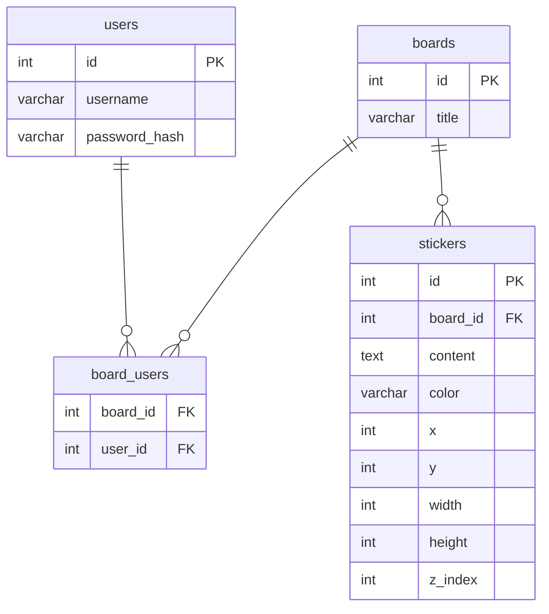

```mermaid
erDiagram
    users {
        int id PK
        varchar username
        varchar password_hash
    }

    boards {
        int id PK
        varchar title
    }

    stickers {
        int id PK
        int board_id FK
        text content
        varchar color
        int x
        int y
        int width
        int height
        int z_index
    }

    board_users {
        int board_id FK
        int user_id FK
    }

    users ||--o{ board_users : ""
    boards ||--o{ board_users : ""
    boards ||--o{ stickers : ""
```
